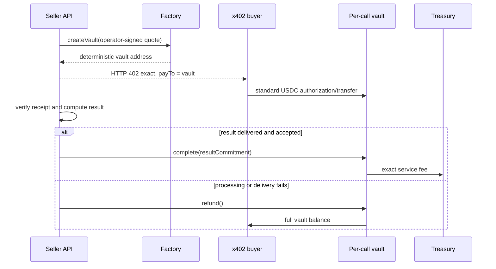

# ResolveSignal Arc x402 Escrow

[](https://github.com/duclucky/resolvesignal-arc-escrow/actions/workflows/ci.yml)
[](LICENSE)
[](https://explorer.arc.io/address/0xB2b41f3e45AEe1Da3D8756bd087277f1194bf3C7)

A reusable Arc primitive for pay-per-call APIs: one deterministic USDC vault per
signed request, compatible with the recipient model used by standard x402 v2
`exact` payments.

The contracts are extracted into this standalone repository so Arc builders can
fork, test, and integrate the payment lifecycle without adopting the
[ResolveSignal](https://resolvesignal.com) application or its backend.

## The problem

A normal x402 transfer proves that a buyer paid a recipient. A pay-per-call
service also needs a bounded lifecycle when processing fails after payment:
which request was paid, where the fee may go, when refund becomes available,
and how late or duplicate transfers are recovered.

This repository adds that missing settlement boundary while preserving the
standard buyer payment flow.

## Reusable primitives

- **Signed EIP-712 quotes** bind `callId`, payer, terms commitment, price, quote
  expiry, and delivery deadline.
- **CREATE2 minimal-proxy vaults** give every call an isolated and predictable
  payment recipient.
- **Standard x402 exact compatibility** lets the buyer authorize a normal USDC
  transfer to the advertised vault; no contract-specific buyer signature is
  required.
- **Atomic terminal states** send the exact fee to treasury after validated
  delivery or return funds to the original payer.
- **Permissionless timeout refunds** prevent operator downtime from trapping a
  funded call indefinitely.
- **Late-payment and surplus recovery** can only return value to the payer bound
  by the signed quote.
- **Privacy-preserving commitments** keep business input and output offchain;
  only hashes, addresses, amounts, and deadlines are public.
- **EOA and ERC-1271 operators** support ordinary and smart-account signing
  policies.

Compared with general Arc commerce and peer-to-peer payment examples, this repo
focuses on the failure boundary between an HTTP 402 payment and an asynchronous
offchain computation.

## Arc Mainnet deployment

| Component | Address |
| --- | --- |
| Factory | [`0xB2b41f3e45AEe1Da3D8756bd087277f1194bf3C7`](https://explorer.arc.io/address/0xB2b41f3e45AEe1Da3D8756bd087277f1194bf3C7) |
| Vault implementation | [`0xdd02Ec2A86CF8b05081bE88DE4C190d0980D067F`](https://explorer.arc.io/address/0xdd02Ec2A86CF8b05081bE88DE4C190d0980D067F) |
| Deployment transaction | [`0x2aaa6bd0c8a6e5455948e6c44346e7cf4f9f60c71c903aea70289100d90e9724`](https://explorer.arc.io/tx/0x2aaa6bd0c8a6e5455948e6c44346e7cf4f9f60c71c903aea70289100d90e9724) |
| USDC | `0x3600000000000000000000000000000000000000` |

Network: Arc Mainnet, chain ID `5042`. The complete public manifest is in
[`deployments/arc-mainnet.json`](deployments/arc-mainnet.json).

This deployment powers ResolveSignal's production payment path. That statement
describes deployment status, not third-party adoption or user traction.

## Lifecycle



After the deadline, anyone can trigger the same payer-bound refund path.

## Build and test

Requirements: Foundry and Git.

```bash
git clone --recurse-submodules https://github.com/duclucky/resolvesignal-arc-escrow.git
cd resolvesignal-arc-escrow
forge fmt --check
forge build --sizes
forge test -vvv
```

Solidity `0.8.30`, OpenZeppelin `5.4.0`, optimizer `200`, EVM target `cancun`.
The current suite passes **53 tests** across unit, fuzz, regression, and
stateful invariant coverage. The invariant campaign executes 4,096 calls over
128 runs with zero reverts. Local tests use a mock token at Arc's USDC address
and do not fully emulate Arc's native-USDC precompile or issuer controls.

## Integrate

Read [`docs/INTEGRATION.md`](docs/INTEGRATION.md) for the seller and buyer flow,
receipt checks, and recovery rules. The high-level design is in
[`docs/ARCHITECTURE.md`](docs/ARCHITECTURE.md), and security assumptions are in
[`docs/THREAT-MODEL.md`](docs/THREAT-MODEL.md).

The deployment script reads only public role addresses from environment
variables. Configure Foundry broadcasting with an encrypted keystore or managed
signer; never pass or commit a private key.

```bash
cp .env.example .env
forge script script/DeployArcEscrow.s.sol:DeployArcEscrow \
  --rpc-url "$ARC_RPC_URL" \
  --sender "$DEPLOYER_ADDRESS"
```

Review the simulation and constructor roles before adding your environment's
explicit broadcast option.

## Security status

The code has automated adversarial and invariant coverage but has **not received
an independent professional audit**. Do not treat this repository, its tests, or
the production deployment as a warranty. Read [SECURITY.md](SECURITY.md) before
using real funds.

## Roadmap

The public roadmap covers client libraries, reference seller adapters, refund
watching, reproducible deployment verification, and an independent audit. See
[`docs/ROADMAP.md`](docs/ROADMAP.md). It intentionally makes no claim of current
third-party mainnet users.

## License

MIT. See [LICENSE](LICENSE).
